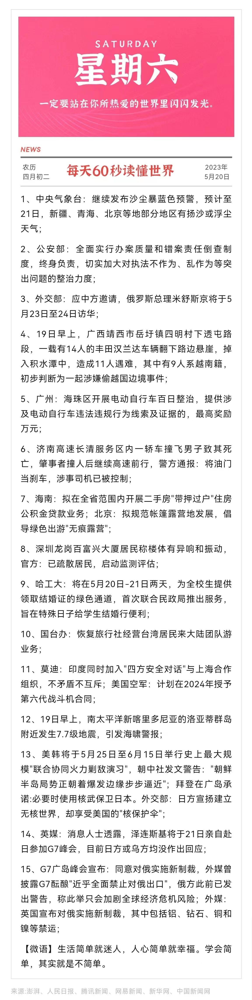

#### Introduction

This is a daily news bot use **github action** and **pushplus**.

#### Configuration

If you want to use it, here are the steps:

1. clone this repository.

2. create a pushplus account and token for push message to your wechat.
3. `Settings -> Secrets and variables -> Actions` in your repository page, click `New repository secret`, the name is `TOKEN`, the secret is your pushplus token, then add secret finally.

You can config the scheduled time in `.github/workflows/main.yml`.

```yml
on:
  schedule: # 每日定时推送新闻
    - cron: "5 20 * * *" # 分 时 日 月 星期, eg: 20:05pm
```

#### Others

If you have any questions, please contact me in wx: `allinjava` and note 「github」.

Finally, if the project is helpful to you, please give the project a **star** ⭐, let more people see it, thanks~

#### Smaple

